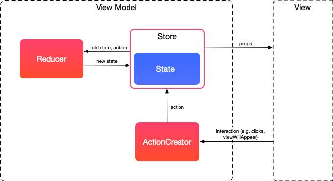

### Motivation

As applications complexity grows, our code must manage more state than ever before. And all of us know that [shared mutable state is bad](https://softwareengineering.stackexchange.com/a/148109).

That's where [Redux](https://redux.js.org) comes in and attempts to **make state mutations predictable**.

### Three Redux Principles

#### 1. Single source of truth

The state of your whole application is stored in an object tree within a single store.

#### 2. State is read-only

The only way to change the state is to emit an action, an object describing what happened.

#### 3. Changes are made with pure functions

To specify how the state tree is transformed by actions, you write pure reducers.

Please refer to the [official Redux ReadMe](https://redux.js.org) for more. It has tons of useful information.

# Redux View Model

We are not trying to port Redux on iOS, instead we applied core principles to our View Models. It helps us to scale complexity linearly and build even the most complicated screens with ease.

##### Redux Components in iOS



Redux View Model constists of the following parts:

1. **Actions** that are payloads of information that send data from your application to your store. You send them to the store using `store.dispatch()`.
2. **Reducers** specify how the application's state changes in response to actions sent to the store. Remember that actions only describe _what_ happened, but don't describe _how_ the application's state changes.
3. **Store** is an object that brings Actions and Reducers together. It provides a way to dispatch Actions and observe State changes.

Let's take a more in-depth look on all of them.

## State

State is a plain struct that holds only data that is required to render a view.
It doesn't meant to be exposed from view model to other architecture components anyhow and must be used by view model's parts only.

```swift
struct TeamChatState {
  var messages: [Message]
  var isLoadingMessages: Bool
}
```

## Actions

Actions are data structures that represent a state modification. We tend to use `enum` to declare all possible actions for the Store, but you may also use `struct`s if you feel an urge to.

```swift
enum TeamChatAction {
  case loadMessages
  case loadMessagesSuccess([Message])
  case deleteMessage(id: Message.Identifier)
}
```

## Reducer

Reducer is a _pure_ function that applies actions to the state. It is important to keep it pure and implement it without side effects to be sure that only way of modifying state is dispatching actions.

```swift
extension TeamChat {
  static func reduce(state: TeamChatState, action: TeamChatAction) -> TeamChatState {
    var state = state

    switch action {
    case .loadMessages:
      state.isLoadingMessages = true

    case let .loadMessagesSuccess(newMessages):
      state.messages.append(newMessages)
      state.isLoadingMessages = false

    case let .deleteMessage(messageIdToDelete):
      state.messages.removeAll(where: { $0.id == messageIdToDelete })
    }

    return state
  }
}
```

You might notice that in the example above we don't actually load the messages when `.loadMessages` action is dispatched. That's because reducers are pure and can't perform network requests. On how to perform asynchronous changes a bit later.

## Store

Store should meet following requirements:

- hold application state;
- allow an access to the current state value;
- allow state to be updated via `dispatch(action)`;
- allow state to be observed.

Store can be easily implemented with or without a reactive framework and be reused in each view model. Here is how the API can look like.

```swift
final class ReduxStore<State, Action> {
  typealias Reducer = (State, Action) -> State

  let state: Observable<State>

  init(initialState: State, reducer: @escaping Reducer)

  func dispatch(_ action: Action)
  func getState() -> State
}
```

You are free to implement the Store yourself or grab one we use - [ReduxStore](resources/ReduxStore.swift).

## Props

Props are described in [the Architecture chapter](4-architecture.md#props). They are just bags of data, that are passed to the View to render current State.
To map state into props we use free pure function `makeProps(from state: State) -> Props`. Function is pure to make sure props (visual representation) depends only on current state.

```swift
extension TeamChat {
  static func makeProps(from state: TeamChatState) -> TeamChatProps {
    return TeamChatProps(
      messages: makeMessages(from: state),
      title: makeTitle(from: state)
    )
  }

  private static func makeTitle(from state: State) -> String {
    return state.isLoadingMessages ? "Loading" : "Chat"
  }

  private static func makeMessages(from state: State) -> [TeamChatProps.Message] {
    return state.messages
      .map { message -> TeamChatProps.Message in
        return TeamChatProps.Message(
          body: message.body,
          senderName: message.sender.name,
          senderAvatarUrl: message.sender.avatarUrl,
          createdAt: message.createdAt
        )
      }
  }
}
```

## View Model

View model is a part that combines and wraps all other parts using reactive framework.
Here you can also see how asyncronous actions are handled with a `loadMessagesAction` and `loadMessagesSuccessAction`.

```swift
final class TeamChatViewModel {
  struct Inputs {
    let loadMessages: Observable<Void>
    let deleteMessage: Observable<Message.Identifier>
  }

  struct Outputs {
    let props: Observable<TeamChatProps>
  }

  func makeOutputs(from inputs: Inputs) -> Outputs {
    // 1. Create a Store
    let initialState = TeamChatState(messages: [], isLoadingMessages: false)
    let store = ReduxStore<TeamChatState, TeamChatAction>(initialState: initialState, reducer: TeamChat.reducer)

    // 2. Map inputs into the Actions
    let loadMessagesAction = inputs.loadMessages
      .map { TeamChatAction.loadMessages }

    let loadMessagesSuccessAction = inputs.loadMessages
      .flatMap { () -> Observable<TeamChatAction> in
        return chatService.loadMessages()
          .map(TeamChatAction.loadMessagesSuccess)
      }

    let deleteMessageAction = inputs.deleteMessage
      .map(TeamChatAction.deleteMessage)

    let actions = Observable.merge([
      loadMessagesAction,
      loadMessagesSuccessAction
      deleteMessageAction
    ])

    // 3. Subscribe for Actions to dispatch them into Store
    actions
      .subscribe(onNext: store.dispatch)
      .disposed(by: disposeBag)

    let props = state
      .map(TeamChat.makeProps(from:))
      .share(replay: 1, scope: .forever)

    return Outputs(props: props)
  }
}
```
